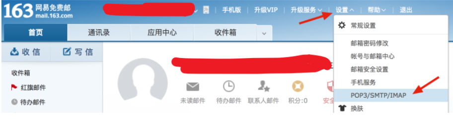

# meiduo_mall
美多商城

目录

[1.项目准备](#1. 项目准备 )

[2.用户注册](#2. 用户注册)


### 实现功能

- 用户  登录，注册，功能
- 购物 功能
- 支付 功能

------------------------------

| 日期 | 计划 | 完成情况 |
|  :---  | :---  |  ----  |
| 2021-4-13 | 项目环境 | ✔ |
| 2021-4-16 | 完成用户注册功能 | ✖ |
|  |  |  |
|  |  |  |
|  |  |  |
|  |  |  |

### 1.项目准备 

环境 

- ```
  py3
  django 
  ```


  前端  www.meiduo.site:8080

  后端  www.meiduo.site:8000

#### 跨域CORS

  **现在，前端与后端分处不同的域名，这就涉及到跨域访问数据的问题，因为浏览器的同源策略，默认是不支持两个不同域间相互访问数据，而我们需要在两个域名间相互传递数据，这时我们就要为后端添加跨域访问的支持。**

  我们使用CORS来解决后端对跨域访问的支持。

  使用django-cors-headers扩展

  [参考文档https://github.com/ottoyiu/django-cors-headers/](https://github.com/ottoyiu/django-cors-headers/)

  - 安装

    ```
    pip install django-cors-headers
    ```

    添加应用

    ```
    INSTALLED_APPS = (
        ...
        'corsheaders',
        ...
    )
    ```

    中间件设置

    ```
    MIDDLEWARE = [
        'corsheaders.middleware.CorsMiddleware',
        ...
    ]
    ```

    白名单 

    ```
    # CORS
    CORS_ALLOWED_ORIGINS = (
        'http://127.0.0.1:8080',
        'http://localhost:8080',
        'http://www.meiduo.site:8080',
        'http://www.meiduo.site:8000'
    )
    CORS_ALLOW_CREDENTIALS = True  # 允许携带cookie
    ```

    


### 2.用户注册&登录&退出

#### 2.1  用户模型类

- 继承 `AbstractUser`

  ```
  
  class User(AbstractUser):
      mobile = models.CharField(max_length=11,unique=True)
  
      class Meta:
          db_table = 'tb_users'
          verbose_name = '用戶'
          verbose_name_plural = verbose_name
  ```

-  在setting中 添加 `AUTH_USER_MODEL = 'users.User'`

  

- **根据项目流程创建 用户名查询次数 视图 判断用户名是否重复注册**

  所有的视图逻辑，	1接收数据   2验证数据  3处理逻辑（包含数据库处理）4 返回响应

  ```
  
  """
  判断用户名是否重复
  前端： 用户输入用户名， 失去焦点， 发送一个axios(ajax)请求
  后端：
  	接收请求，： 接收用户
  	路由； get /usernames/<username>/count/
  	业务逻辑：
  		根据用户名，查询数据库， 查询当前数量， 数量大于0说明已经注册过了
  	响应：json格式
  		{"count":1, "code": "0", "errmsg": "ok"}
  
  """
  
  
  class UsernameView(View):
  	def get(self, request, username):
  		# 1. 接收 数据 打印 用户名
  		print(username)
  		# 2. 根据用户名查数据库
  		conut = User.objects.filter(username=username).count()
  		# 3. 返回响应
  		return JsonResponse({"count": count, "code": "0", "errmsg": "OK"})
  ```

- **根据项目流程创建 手机号查询次数 视图 判断手机号是否重复注册**

  ```python
  """
  判断手机号是否重复注册
  前端：用户输入手机号，失去焦点， 发送一个axios(ajax)请求
  后端：
      接收请求，： 接收用户
  	路由； get mobiles/<phone:mobile>/count/
  	业务逻辑：
  		根据手机号，查询数据库， 查询当前数量， 数量大于0说明已经注册过了
  	响应：json格式
  		{"count":1, "code": "0", "errmsg": "ok"}
  """
  class MobileCountView(View):
      def get(self, request, mobile):
          # print(mobile)
          count = User.objects.filter(mobile=mobile).count()
          return JsonResponse({"count": count, "code": "0", "errmsg": "ok"})
  
  ```

- 图片验证码

  - **通过captcha包 生成图片验证码**

    - ` pip install Pillow  `

  - 测试 视图

    - ```
      from django.http import HttpResponse
      from django.shortcuts import render
      
      # Create your views here.
      from django.views import View
      from django_redis import get_redis_connection
      
      from utils.captcha.captcha import captcha
      
      
      ​```
      图片验证码
      前端：用户点击验证码 生成uuid 拼接url 发送请求
      后端：
      	接收请求  get 
      	路由：get '/image_code/<uuid>/'
      	业务逻辑：获取uuid 生成图片验证码，二进制数据， uuid作为key 存入reids数据库
       	响应 返回二进制数据
       	
      ​```
      
      class IMageCodeView(View):
      	def get(self, request, uuid):
      		# 1.打印图片id
      		print('图片id',uuid)
      		#   2. 生成验证码图片，二进制数据
              text, image = captcha.generate_captcha()
              print('图片验证码数据',text)
              #   3. 存到redis UUID作为key
              #   get_redis_connection  获取redis 数据库
              redis_cli = get_redis_connection("image_code")
              #  uuid 为key 120s是过期时间
              redis_cli.setex(uuid,120,text)
      
              #   4. 返回二进制图片数据
              return HttpResponse(image,content_type='image/jpeg')
      		
      		
      		
      		
      ```

    - 添加 redis    image_code

      ```
      "image_code": { # session
              "BACKEND": "django_redis.cache.RedisCache",
              "LOCATION": "redis://127.0.0.1:6379/2",
              "OPTIONS": {
                  "CLIENT_CLASS": "django_redis.client.DefaultClient",
              }
          },
      ```

    - 添加路由 

      - ```
        urlpatterns = [
        	path('image_codes/<uuid>/', ImageCodeView.as_view()),
        
        ]
        ```

      - 总路由

      - 

 - 短信验证码注册

   1. 使用 容联云 api 服务
   2. 创建sms 包，并添加异步


**前期 准备图片验证，短信验证，都已完毕，下面实现注册视图**

#### 2.2  注册视图 

```
​```
注册 
前端：用户输入，用户名，密码，确认密码，手机号，同意协议，点击注册按钮， 发送axios 请求
后端：
	接收请求：post 请求 json 数据
	路由： post '/register/'
	业务逻辑： 验证数据， 保存到数据库
	响应json 格式
		{"code":0, "errmsg": "ok"}
		{"code":400, "errmsg": "register fail"}
		
	
		
​```

class RegisterView(View):
	def post(self, request):
		# 1. 接收数据
		body_dict = json.loads(request.body)
		
		# 2. 提取数据
		username = body_dict.get("username")
		password = body_dict.get("password")
		password2 = body_dict.get("password2")
		mobile = body_dict.get("mobile")
		sms_code = body_dict.get("sms_code")
		allow = body_dict.get("allow")
		
		# 3.1. 判断数据是否存在
		if not (username, password, password2, mobile, sms_code, allow):
		 	return JsonResponse({"code":400, "errmsg": "register fail"})
		 	
		 # 3.2  判断re匹配 username
		if not re.match(r"^[a-zA-Z0-9_-]{5,20}", username):
		 	return JsonResponse({"code":400, "errmsg": "register fail"})
			
		# 数据保存到数据库
		# user = User.objects.create(username=username,password=password,mobile=mobile)
		# user.save()
		# user = User(username=username,password=password,mobile=mobile)
		# user.save()
		try:
            user = User.objects.create_user(username=username,password=password,mobile=mobile)
            user.save()
        except Exception as e:
        	print(e)
        	print('数据库报错》》》》')
		 	return JsonResponse({"code":400, "errmsg": "register fail"})
        	
        return JsonResponse({"code":0, "errmsg": "ok"})
		
		

```

**postman 发送post**


**打印结果**

- 1. 


#### 

- ### Django 邮件 流程

  这里使用 `send_mall()`

  - 位置：

    - 在`django.core.mail`模块提供了`send_mail()`来发送邮件

  - 方法参数：

    - `send_mail(subject, message, from_email, recipient_list,html_message=None)`

      ```py
      subject 邮件标题
      message 普通邮件正文，普通字符串
      from_email 发件人
      recipient_list 收件人列表
      html_message 多媒体邮件正文，可以是html字符串
      ```

  **准备发邮服务器**

  这里使用163

  

  开启授权设置

  

  记录授权码，

  **在setting中配置邮箱服务器**

  ```
  EMAIL_BACKEND = 'django.core.mail.backends.smtp.EmailBackend'
  EMAIL_HOST = 'smtp.163.com'
  EMAIL_PORT = 25
  #发送邮件的邮箱
  EMAIL_HOST_USER = 'qi_rui_hua@163.com'
  #在邮箱中设置的客户端授权密码
  EMAIL_HOST_PASSWORD = '123456abc'
  #收件人看到的发件人
  EMAIL_FROM = '美多商城<qi_rui_hua@163.com>'
  ```

  **同样发送邮箱验证也是用celery **

  

  `tasks.py`文件中

  ```
  import logging
  from django.conf import settings
  from django.core.mail import send_mail
  from celery_tasks.main import celery_app 
  
  logger = logging.getLogger('django')
  
  @celery_app.task( name='send_verify_email')
  def send_verify_email(to_email, verify_url):
      """
      发送验证邮箱邮件
      :param to_email: 收件人邮箱
      :param verify_url: 验证链接
      :return: None
      """
      subject = "美多商城邮箱验证"
      html_message = '<p>尊敬的用户您好！</p>' \
                     '<p>感谢您使用美多商城。</p>' \
                     '<p>您的邮箱为：%s 。请点击此链接激活您的邮箱：</p>' \
                     '<p><a href="%s">%s<a></p>' % (to_email, verify_url, verify_url)
      try:
          send_mail(subject, "", settings.EMAIL_FROM, [to_email], html_message=html_message)
      except Exception as e:
          logger.error(e)
  ```

  在`main.py`中注册发送邮件任务

  ```
  # 自动注册celery任务
  celery_app.autodiscover_tasks(['celery_tasks.sms', 'celery_tasks.email'])
  ```

  邮件视图

  ```
  from django import http
  
  
  class SaveEmailView(View):
      """添加邮箱"""
  
      def put(self, request):
          """实现添加邮箱逻辑"""
          # 接收参数
          json_dict = json.loads(request.body.decode())
          email = json_dict.get('email')
  
          # 校验参数
          if not email:
              return http.JsonResponse({'code': 400,
                                        'errmsg': '缺少email参数'})
          if not re.match(r'^[a-z0-9][\w\.\-]*@[a-z0-9\-]+(\.[a-z]{2,5}){1,2}$', email):
              return http.JsonResponse({'code': 400,
                                        'errmsg': '参数email有误'})
  
          # 赋值email字段
          try:
              request.user.email = email
              request.user.save()
          except Exception as e:
              logger.error(e)
              return http.JsonResponse({'code': 400, 'errmsg': '添加邮箱失败'})
  
          # 异步发送验证邮件
          from celery_tasks.email.tasks import send_verify_email
          # 生成验证链接
          # verify_url = '邮件验证链接'
          verify_url = generate_verify_email_url(request.user)
          subject = "美多商城邮箱验证"
          # 拼接 邮件内容
          html_message = '<p>尊敬的用户您好！</p>' \
                         '<p>感谢您使用美多商城。</p>' \
                         '<p>您的邮箱为：%s 。请点击此链接激活您的邮箱：</p>' \
                         '<p><a href="%s">%s<a></p>' % (email, verify_url, verify_url)
  
          send_verify_email.delay(subject=subject, to_email=email, html_message=html_message)
  
          # 响应添加邮箱结果
          return http.JsonResponse({'code': 0, 'errmsg': '添加邮箱成功'})
  
  ```

  

  

  

### 3.用户中心

- 新建App `areas`

  ```
  python manage.py startapp areas
  ```

  **注册主路由**

  

- #### 收货地址

  1. ##### area 模型类

     ```
     from django.db import models
     
     class Area(models.Model):
         """省市区"""
         name = models.CharField(max_length=20, verbose_name='名称')
         parent = models.ForeignKey('self', on_delete=models.SET_NULL, related_name='subs', null=True, blank=True, verbose_name='上级行政区划')
     
         class Meta:
             db_table = 'tb_areas'
             verbose_name = '省市区'
             verbose_name_plural = '省市区'
     
         def __str__(self):
             return self.name
     ```

     

  2. ##### area 视图

  3. 

### 4.商品

### 5.购物车

6.订单

7.支付

8.部署

